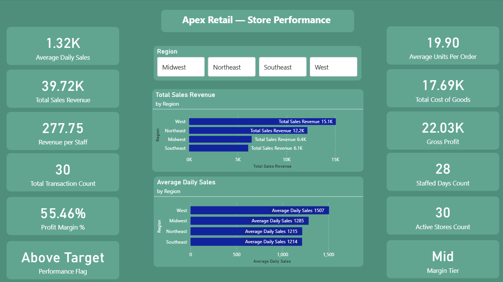

# Power BI Dashboards

Power BI dashboards and reports built during my work at Inova Health System
and data analytics coursework.

## 🛠 Tools Used
Power BI, DAX, Power Query, SQL, Excel

## 📁 Dashboards

### 1. Apex Retail Sales Dashboard
An end-to-end retail sales dashboard tracking revenue, orders, and trends.
- **Tools:** Power BI, DAX, Power Query
- **Skills:** KPI Reporting, Data Visualization, Dashboard Development
- **Key metrics:** Total Revenue (7,189) · Total Orders (27) · Avg Order Value ($299.54)
- **Visuals:** Revenue by Region, Revenue by Product Category, Revenue over Time

### 2. Apex Retail — Store Performance Dashboard
A store performance dashboard with advanced DAX calculations and regional slicers.
- **Tools:** Power BI, DAX
- **Skills:** Calculated Columns & Measures, KPI Reporting, Data Modeling
- **Key metrics:** Total Sales Revenue (39.72K) · Profit Margin % (55.46%) · Gross Profit (22.03K) · Performance Flag (Above Target)
- **Visuals:** Total Sales Revenue by Region, Average Daily Sales by Region, Region slicer

## 📌 Notes
Power BI .pbix files are not uploaded directly — see screenshots above.
